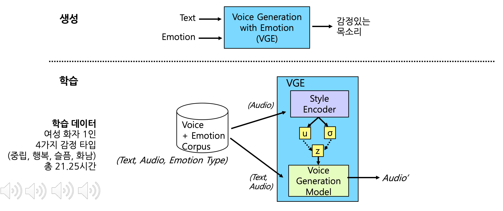
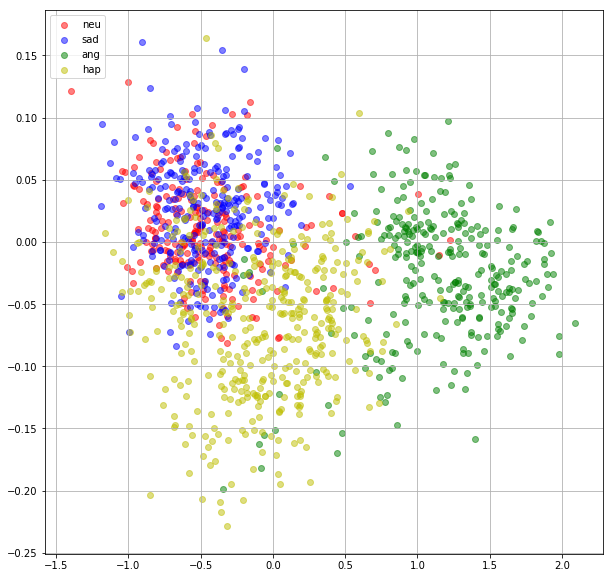
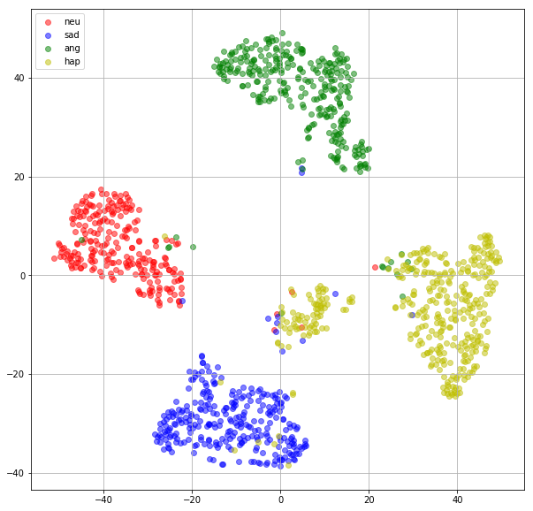
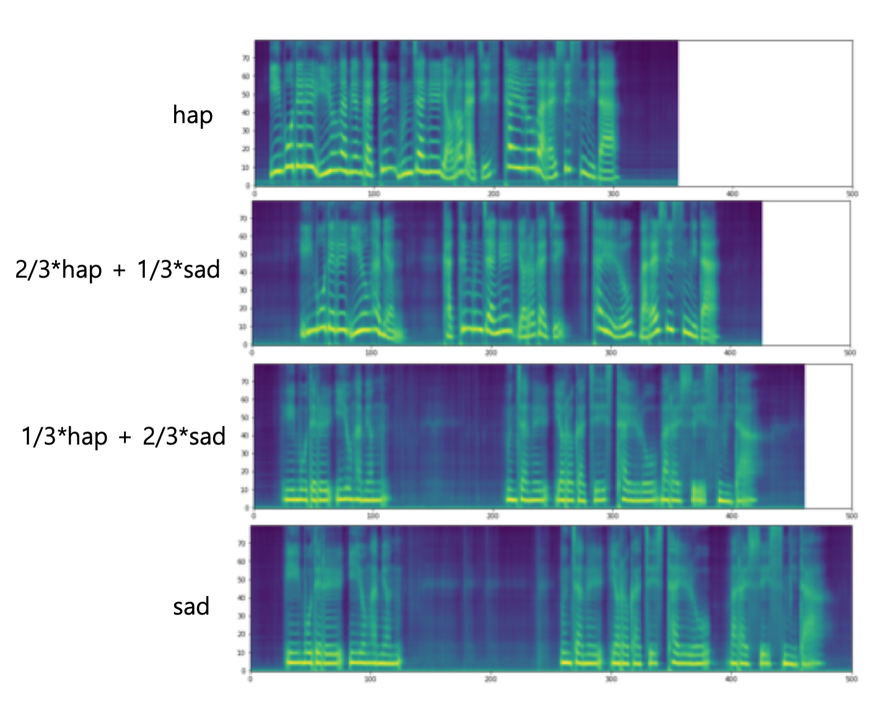
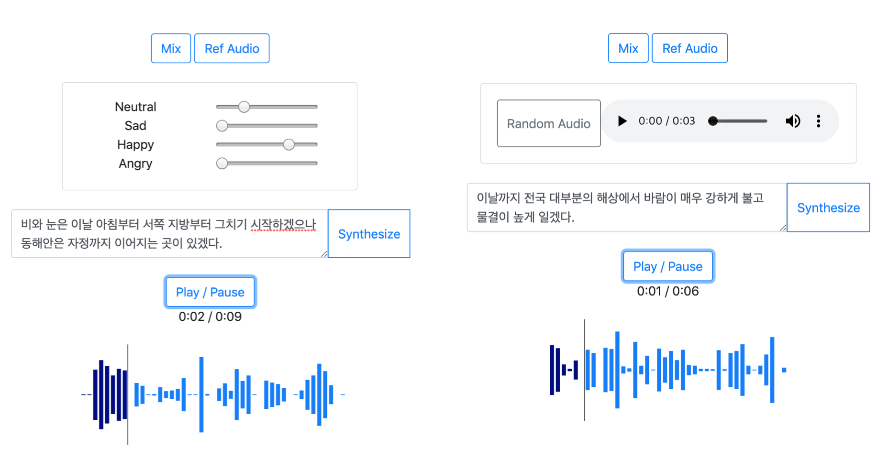

# tacotron2-vae

## Overview


- Generate emotional voices by receiving text and emotional label as input
- Korean Version of ["Learning Latent Representations for Style Control and Transfer in End-to-end Speech Synthesis"](https://arxiv.org/pdf/1812.04342.pdf)

## Data
1. Dataset
    * Korean Speech Emotion Dataset ([more info](http://aicompanion.or.kr/kor/main/))
    * Single Female Voice Actor recorded six diffrent emotions(neutral, happy, sad, angry, disgust, fearful), each with 3,000 sentences.
    * For training, I used four emotions(neutral,happy,sad,angry), total 21.25 hours

2. Text
    * test: `python -m text.cleaners`
    * examples
    ```
    감정있는 한국어 목소리 생성
     ==>
    ['ᄀ', 'ㅏ', 'ㅁ', 'ᄌ', 'ㅓ', 'ㅇ', 'ᄋ', 'ㅣ', 'ㅆ', 'ᄂ', 'ㅡ', 'ㄴ', ' ', 'ᄒ', 'ㅏ', 'ㄴ', 'ᄀ', 'ㅜ', 'ㄱ', 'ᄋ', 'ㅓ', ' ', 'ᄆ', 'ㅗ', 'ㄱ', 'ᄉ', 'ㅗ', 'ᄅ', 'ㅣ', ' ', 'ᄉ', 'ㅐ', 'ㅇ', 'ᄉ', 'ㅓ', 'ㅇ', '~']
     ==>
    [2, 21, 57, 14, 25, 62, 13, 41, 61, 4, 39, 45, 79, 20, 21, 45, 2, 34, 42, 13, 25, 79, 8, 29, 42, 11, 29, 7, 41, 79, 11, 22, 62, 11, 25, 62, 1] 
    ```

3. Audio
    * sampling rate: 16000
    * filter length: 1024
    * hop length: 256
    * win length: 1024
    * n_mel: 80
    * mel_fmin: 0
    * mel_fmax: 8000

4. Training files
    * `./filelists/*.txt`
    * path | text | speaker | emotion
    * examples
    ```
    /KoreanEmotionSpeech/wav/neu/neu_00002289.wav|선생님이 초록색으로 머리를 염색하고 나타나서 모두들 깜짝 놀랐다.|0|0
    /KoreanEmotionSpeech/wav/sad/sad_00002266.wav|과외 선생님이 열심히 지도해준 덕택에 수학실력이 점점 늘고 있다.|0|1
    /KoreanEmotionSpeech/wav/ang/ang_00000019.wav|명백한 것은 각 당이 투사하고 있는 실상과 허상이 있다면 이제 허상은 걷어들여야 한다는 것이다.|0|2
    /KoreanEmotionSpeech/wav/hap/hap_00001920.wav|강력한 스크럽으로 상쾌한 양치효과를 주네요.|0|3
    ```

## Training
1. Prepare Datasets
2. Clone this repo: `git clone https://github.com/jinhan/tacotron2-vae.git`
3. CD into this repo: `cd tacotron2-vae`
4. Initialize submodule: `git submodule init; git submodule update`
5. Update .wav paths: `sed -i -- 's,DUMMY,ljs_dataset_folder/wavs,g' filelists/*.txt`
6. Install requirements `pip install -r requirements.txt`
7. Training: `python train.py --output_directory=outdir --log_directory=logdir -- hparams=training_files='filelists/koemo_spk_emo_all_train.txt',validation_files='filelists/koemo_spk_emo_all_valid.txt',anneal_function='constant',batch_size=6`
8. Monitoring: `tensorboard --logdir=outdir/logdir --host=127.0.0.1`
9. Training results (~ 250,000 steps)


## Visualization
source: `inference.ipynb`

1. Load Models 

    tacotron2-vae model

    ```python
    model = load_model(hparams)
    model.load_state_dict(torch.load(checkpoint_path)['state_dict'])
    _ = model.eval()
    ```

    WaveGlow vocoder model

    ```python
    waveglow = torch.load(waveglow_path)['model']
    waveglow.cuda()
    ```

2. Load Data
    - 'Prosody' is the output of the fully connected layer to match dimension of z and text-encoded output.
    
    ```python
    path = './filelists/koemo_spk_emo_all_test.txt'
    with open(path, encoding='utf-8') as f:
        filepaths_and_text = [line.strip().split("|") for line in f]

    model.eval()
    prosody_outputs = []
    emotions = []
    mus = []
    zs = []

    for audio_path, _, _, emotion in tqdm(filepaths_and_text):
        melspec = load_mel(audio_path)
        prosody, mu, _, z = model.vae_gst(melspec)
        prosody_outputs.append(prosody.squeeze(1).cpu().data) 
        mus.append(mu.cpu().data)
        zs.append(z.cpu().data)
        emotions.append(int(emotion))

    prosody_outputs = torch.cat(prosody_outputs, dim=0)
    emotions = np.array(emotions)
    mus = torch.cat(mus, dim=0)
    zs = torch.cat(zs, dim=0)
    ```

3. Scatter plot

    ```python
    colors = 'r','b','g','y'
    labels = 'neu','sad','ang','hap'

    data_x = mus.data.numpy()
    data_y = emotions

    plt.figure(figsize=(10,10))
    for i, (c, label) in enumerate(zip(colors, labels)):
        plt.scatter(data_x[data_y==i,0], data_x[data_y==i,1], c=c, label=label, alpha=0.5)

    axes = plt.gca()
    plt.grid(True)
    plt.legend(loc='upper left')
    ```
    
    
4. t-SNE plot

    ```python
    colors = 'r','b','g','y'
    labels = 'neu','sad','ang','hap'

    data_x = mus
    data_y = emotions

    tsne_model = TSNE(n_components=2, random_state=0, init='random')
    tsne_all_data = tsne_model.fit_transform(data_x)
    tsne_all_y_data = data_y

    plt.figure(figsize=(10,10))
    for i, (c, label) in enumerate(zip(colors, labels)):
        plt.scatter(tsne_all_data[tsne_all_y_data==i,0], tsne_all_data[tsne_all_y_data==i,1], c=c, label=label, alpha=0.5)

    plt.grid(True)
    plt.legend(loc='upper left')
    ```
    


## Inference 
source: `inference.ipynb`
    
### Reference Audio
- Generate voice that follows the style of the reference audio

    Reference audio

    ```python
    def generate_audio_vae_by_ref(text, ref_audio):
        transcript_outputs = TextEncoder(text)

        print("reference audio")
        ipd.display(ipd.Audio(ref_audio, rate=hparams.sampling_rate))

        ref_audio_mel = load_mel(ref_audio)
        latent_vector, _, _, _ = model.vae_gst(ref_audio_mel)
        latent_vector = latent_vector.unsqueeze(1).expand_as(transcript_outputs)

        encoder_outputs = transcript_outputs + latent_vector

        synth, mel_outputs = Decoder(encoder_outputs)

        ipd.display(ipd.Audio(synth[0].data.cpu().numpy(), rate=hparams.sampling_rate))
        ipd.display(plot_data(mel_outputs.data.cpu().numpy()[0]))
    ```

    Generate voice

    ```python
    text = "이 모델을 이용하면 같은 문장을 여러가지 스타일로 말할 수 있습니다."
    ref_wav = "/KoreanEmotionSpeech/wav/ang/ang_00000100.wav"
    generate_audio_vae_by_ref(text, ref_wav)
    ```
### Interpolation
- Create a new z by multiply ratios to the centroids.

    Interpolation

    ```python
    def generate_audio_vae(text, ref_audio, trg_audio, ratios):
        transcript_outputs = TextEncoder(text)

        for ratio in ratios:
            latent_vector = ref_audio * ratio + trg_audio * (1.0-ratio)
            latent_vector = torch.FloatTensor(latent_vector).cuda()
            latent_vector = model.vae_gst.fc3(latent_vector)

            encoder_outputs = transcript_outputs + latent_vector

            synth, mel_outputs_postnet = Decoder(encoder_outputs)
            ipd.display(ipd.Audio(synth[0].data.cpu().numpy(), rate=hparams.sampling_rate))
            ipd.display(plot_data(mel_outputs_postnet.data.cpu().numpy()[0]))
    ```  

    Get Centroids

    ```python
    encoded = zs.data.numpy()
    neu = np.mean(encoded[emotions==0,:], axis=0)
    sad = np.mean(encoded[emotions==1,:], axis=0)
    ang = np.mean(encoded[emotions==2,:], axis=0)
    hap = np.mean(encoded[emotions==3,:], axis=0)
    ```

    Generate voice

    ```python
    text = "이 모델을 이용하면 같은 문장을 여러가지 스타일로 말할 수 있습니다."
    ref_audio = hap
    trg_audio = sad
    ratios = [1.0, 0.64, 0.34, 0.0]
    generate_audio_vae(text, ref_audio, trg_audio, ratios)
    ```
    
    

### Mixer
- Result of mixing more than two labels at a desired ratio

    Mixer

     ```python
     def generate_audio_vae_mix(text, ratios):
        transcript_outputs = TextEncoder(text)

        latent_vector = ratios[0]*neu + ratios[1]*hap + ratios[2]*sad + ratios[3]*ang
        latent_vector = torch.FloatTensor(latent_vector).cuda()
        latent_vector = model.vae_gst.fc3(latent_vector)

        encoder_outputs = transcript_outputs + latent_vector

        synth, mel_outputs = Decoder(encoder_outputs)

        ipd.display(ipd.Audio(synth[0].data.cpu().numpy(), rate=hparams.sampling_rate))
        ipd.display(plot_data(mel_outputs.data.cpu().numpy()[0]))
    ```

    Generate voice

    ```python
    text = "이 모델을 이용하면 같은 문장을 여러가지 스타일로 말할 수 있습니다."
    ratios = [0.0, 0.25, 0.0, 0.75] #neu, hap, sad, ang
    generate_audio_vae_mix(text, ratios)
    ```
    
## Demo page
1. Run: `python app.py --checkpoint_path="./models/032902_vae_250000" --waveglow_path="./models/waveglow_130000"`
2. Mix: Generate voices by adjusting the ratio of netural, sad, happy, and angry
3. Ref Audio: Generate voices by testset audio as a reference audio




## Samples
- Interpolation: Result of interpolating between two labels at 1.0, 0.66, 0.33, and 0.0
- refs: Result of recorded audio as a reference audio
- mix: Result of mixing more than two labels at a desired ratio

## References
- Tacotron2: https://github.com/NVIDIA/tacotron2
- Prosody Encoder: https://github.com/KinglittleQ/GST-Tacotron/blob/master/GST.py
- WaveGlow: https://github.com/NVIDIA/waveglow
- Export Images from tfevents: https://github.com/anderskm/exportTensorFlowLog
